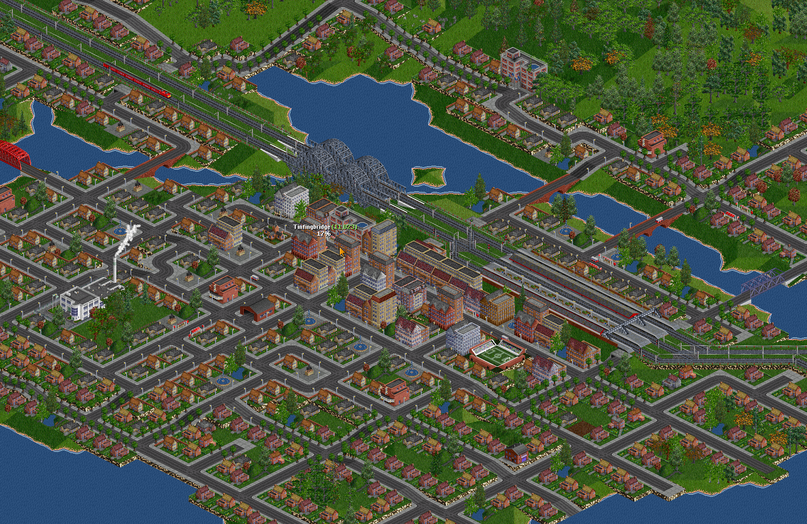

# ITL Houses

_Photo credit: Kale on Discord_

A house replacement set using default graphics with new rules and features, for **Temperate**, **Subarctic**, and **Subtropic**.

Formerly known as `Improved Town Layouts`.

## Subarctic & Subtropic Features
### Better downtowns and suburbs
- Flats are capped at 1 per every 10 houses
- Each office building requires 1000 population
- Office buildings cluster together into a commercial district
- Landmarks (theatre, cinema, etc) and office buildings added from other climates for greater variety

### Houses selected by land value
- Land value is added by:
  - Water nearby
  - Being close to a town center
  - Being in a city
  - Not being in desert
  - Having a fountain or statue nearby
  - Being in the catchment of a station receiving passengers, mail, goods, water, food, or vehicles (FIRS)
- Houses with accent colours are recoloured based on the land value:
  - 4..6: Red
  - 7..9: Yellow
  - 10..12: Green
  - 13-15: Blue
  - 16-18: Purple
  - 19+: Pink

## Temperate Features 
(Legacy features, to be changed to match Subarctic and Subtropic)

### Better downtowns and suburbs
- High-density residential and commercial buildings only grow within the coverage area of a passenger station
- Downtown buildings cluster together
  - Pre-skyscraper brick buildings cluster separately from skyscrapers, so some cities have a separate "Old" and "New Town"
  - Note: A gap in passenger station coverage will block the cluster from expanding in that direction, since buildings may only grow within 2 tiles of another in its cluster
- Downtowns stay proportional to the town
  - Each office building requires houses for its workers, so the towers won't overrun the suburbs

### Historic Preservation
- All buildings have longer lifespans to reduce the churn of constant rebuilding
- Historic downtown buildings are kept in some towns, but demolished in others
- Landmark buildings last forever

### Landmark buildings
- Landmarks lend character to your city and often generate increased passenger traffic
- Some landmarks only grow in Cities (Hotel, Spa)
- Some landmarks only grow when the town has enough population (Stadium, University, Courthouse)
- All landmarks are kept from appearing too often, either some distance apart or only one per town

### Start as early as 1700
- Introduction dates range from 1700 to 2000, allowing a slow progression over time
- Old houses accept Wood (until 1850) and Coal (until 1945) for fuel
- Early buildings have reduced population to allow older, slower vehicles to keep up with demand
  - 1700-1850: 1/4 population
  - 1850-1950: 1/2 population

## Compatibilities
- Compatible with all industry sets and GameScripts (please report any problems)
- Uses only base game sprites, thus compatible with any base graphics set including Original TTD, OpenGFX, aBase, zBase, and NightGFX
- Requires OpenTTD version 1.10.0, JGR version 0.34, or better.

## Parameters
Use additional sprites. Default off.
- Use Bank sprites
  - Adds the Bank sprites as a University (temperate bank sprite) and a Courthouse (sub-arctic bank sprite)
  - Not recommended if playing with an industry set which includes banks
- Use FIRS Hotel sprites
  - Adds the sub-arctic Hotel sprite as a Spa
  - Not recommended if playing with FIRS, which also uses this sprite
- Use sub-tropical sprites (Temperate climate)
  - Adds the sub-tropical church sprite as an additional Church type
  - Adds one of the flats sprites as a random sprite of the Warehouse

## Code Reference
All code is commented and is organized into several .nml files which are combined by a simple Python script into a merged .nml file for compiling into the .grf. All of these files are in /src/.

If you have any questions, please feel free to contact me and I will do my best to help.

## Translations
Currently available in:
- English
- Simplified Chinese (SuperCirno)
- Traditional Chinese (jjyao88)
- Czech (adpro)
- French (arikover)
- German (WoelfiVW)

Please feel free to translate into your language and submit a Pull Request.

## Limitations / Not in Scope
- This is a house replacement set. It does not improve the behavior of other NewGRF houses, how towns build roads, or [town growth](https://wiki.openttd.org/en/Manual/Towns#town-growth).
